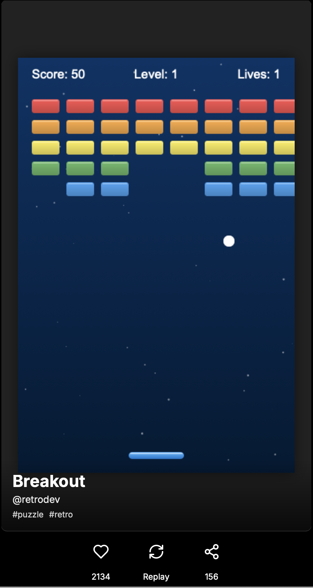

# GameTok

A TikTok-style swipeable feed for lightweight HTML/CSS/JavaScript games. GameTok provides an immersive, mobile-first experience for playing and sharing simple web games.



## Features

- **Vertical Swipeable Feed**: Navigate between games with intuitive swipe gestures
- **Responsive Design**: Optimized for mobile and desktop experiences
- **Game Controls**: Like, share, and replay functionality for each game
- **Embedded Games**: HTML games run in sandboxed iframes with proper messaging for pause/resume
- **Modern UI**: Clean, minimal interface that puts focus on the games

## Demo Games

The project includes three demo games:
- Flappy Bird Clone
- Snake Classic
- Breakout

## Tech Stack

- [Next.js](https://nextjs.org/) - React framework
- [TypeScript](https://www.typescriptlang.org/) - Type safety
- [Tailwind CSS](https://tailwindcss.com/) - Styling
- [Radix UI](https://www.radix-ui.com/) - UI components
- [Lucide React](https://lucide.dev/) - Icons

## Getting Started

### Prerequisites

- Node.js (v18 or later recommended)
- pnpm package manager

### Installation

1. Clone the repository:
   ```bash
   git clone https://github.com/yourusername/gametok.git
   cd gametok
   ```

2. Install dependencies:
   ```bash
   pnpm install
   ```

3. Start the development server:
   ```bash
   pnpm dev
   ```

4. Open [http://localhost:3000](http://localhost:3000) in your browser to see the application.

## Project Structure

- `/app` - Next.js app router components
- `/components` - React components
- `/public/games` - HTML game files
- `/styles` - Global CSS
- `/hooks` - Custom React hooks

## Adding Your Own Games

To add a new game:

1. Create an HTML file in the `/public/games` directory
2. Add your game to the `GAMES` array in `components/game-feed.tsx`
3. Make sure your game implements messaging for pause/resume functionality

Example game entry:
```typescript
{
  id: "your-game",
  title: "Your Game Title",
  creator: "@yourhandle",
  hashtags: ["#tag1", "#tag2"],
  likes: 0,
  shares: 0,
  gameUrl: "/games/your-game.html",
}
```

## Contributors

- James Bell - Initial work

## License

This project is licensed under the MIT License - see the LICENSE file for details.

## Acknowledgments

- Inspired by TikTok's vertical scrolling interface
- Built with [shadcn/ui](https://ui.shadcn.com/) components 